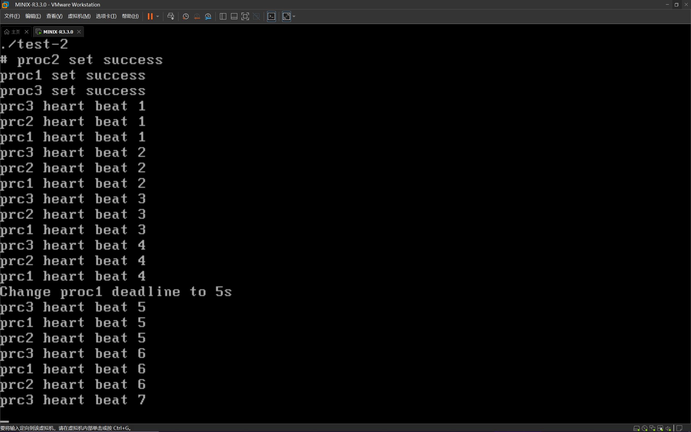
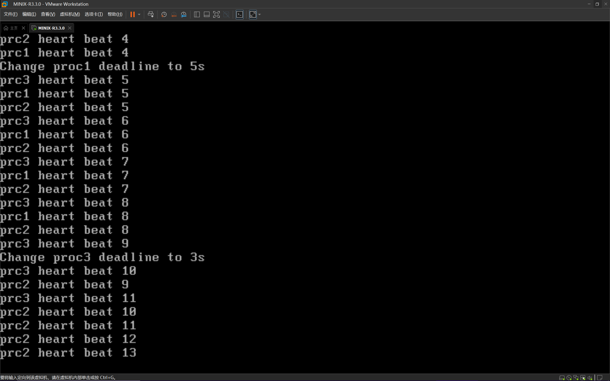

# 操作系统第二次实验

## 一、 实验内容

1. 巩固操作系统的进程调度机制和策略 
2. 熟悉MINIX系统调用和MINIX调度器的实现

## 二、实验要求

在MINIX3中实现Earliest-Deadline-First近似实时调度功能：

提供设置进程执行期限的系统调度chrt (long deadline)，用于将调 用该系统调用的进程设为实时进程，其执行的期限为：从调用处开始deadline秒。

chrt的定义： int chrt(long deadline); 

/*deadline 是最后期限值(秒)，返回值1表示成功，返回值0表示该调用出错 */

## 三、实验环境

```
Vmware WorkStation Pro == 16.0.0
MINIX                  == R3.3.0
Visual Studio Code     == 1.66.2
```

另外我还在MINIX上配置了github, 可以看一看我的博客[index (y-jiji.github.io)](https://y-jiji.github.io/Personal-Blog/), 最近在用hexo重新搭, 现在上面看着很潦草, 甚至没有导览页. 

## 四、代码实现

实验检查的时候小双助教说将及时进程改为非及时进程的时候不要改优先级, 这里也改过来了. 

详情见change.txt文件(Project-2-Naive分支), 这是控制出队实现的，此处只描述大致思路. (可能有遗漏的代码段, 见change.txt)

另有控制入队实现的方法(Project-2分支), 详情见change-enqueue.txt

<<应用层>>

```c
/* 
文件 : /usr/src/include/unistd.h 
描述 : 添加chrt函数原型
*/
int chrt(unsigned long);

/* 
文件 : /usr/src/include/unistd.h 
描述 : 新建文件. 添加chrt函数实现, 将加上当前时间的ddl写入message, 呼叫pm进程执行相关功能
*/
#include <sys/cdefs.h>
#include "namespace.h"
#include <lib.h>

#include <string.h>
#include <unistd.h>
#include <time.h>

int chrt(unsigned long ddl){
    alarm(ddl);
    message m;
    memset(&m, 0, sizeof(m));
    if (ddl != 0)
        m.m_u32.data[0] = ddl + (unsigned)(time(NULL));
    else
        m.m_u32.data[0] = ~0u;
    return(_syscall(PM_PROC_NR, PM_CHRT, &m));
}
```

<<服务层>>

```c
/* 
文件 : /usr/src/minix/servers/pm/proto.h
描述 : 添加do_chrt系统调用函数原型
*/
int do_chrt(void);

/*
文件 : /usr/src/minix/servers/pm/chrt.c
描述 : pm进程接到呼叫后调用sys_chrt传送自动修改的全部变量who_e和message中的ddl
*/
#include "pm.h"
int do_chrt() {
    return sys_chrt(who_e, m_in.m_u32.data[0]);
}

/*
文件 : /usr/src/minix/callnr.h
描述 : 添加 PM_CHRT 并修改pm进程的调用数目
*/
#define PM_CHRT             (PM_BASE + 48)
#define NR_PM_CALLS          49 

```

<<系统层>>

```c
/*
文件 ： /usr/src/minix/kernel/proc.c
描述 : 添加 volatile uint32_t ddl; 属性
*/
struct proc {
    volatile uint32_t ddl;
    ...
}

/* 
文件 : /usr/src/minix/include/minix/syslib.h
描述 : sys_chrt函数原型
*/
int sys_chrt(endpoint_t proc_ep, uint32_t ddl);

/*
文件: /usr/src/minix/lib/libsys/sys_chrt.c
描述: 新建文件, 添加 sys_chrt函数 封装内核调用
*/
int sys_chrt(
    endpoint_t proc_ep,
    uint32_t ddl
) {
    message m;
    m.m_u32.data[0] = proc_ep;
    m.m_u32.data[1] = ddl;
    return (_kernel_call(SYS_CHRT, &m));
}

/* 
文件 : /usr/src/minix/kernel/system.c
描述 : 添加 map(SYS_CHRT, do_chrt) 将调用映射到do_chrt
*/
void system_init(void) {
    ...
    map(SYS_CHRT, do_chrt); /* change a process to real time process */
    ...
}

/* 
文件 : minix/kernel/system.h
描述 : 添加 do_chrt(struct proc * caller, message *m_ptr); 函数原型
*/
int do_chrt(struct proc * caller, message *m_ptr);

/*
文件 : minix/kernel/system/do_chrt.c
描述 : 新建文件, 添加 do_chrt函数
*/
#include "kernel/system.h"
#include <minix/endpoint.h>
#include "kernel/clock.h"
int do_chrt(struct proc * caller, message * m_ptr) {
    int proc_nr;
    /* check and get proc_nr */
    if (!isokendpt(m_ptr->m_u32.data[0], &proc_nr))
        return EINVAL;
    /* get proc, change ddl */
    struct proc* p = proc_addr(proc_nr);
    p->ddl = m_ptr->m_u32.data[1];
    /* reschedule this process */
    return sched_proc(p, 5, -1, -1);
}

/*
文件 : /usr/src/minix/kernel/proc.c
描述 : 添加入队出队调控机制
*/

void enqueue(struct proc* rp) {
    ...
    if (~rp->ddl) q = rp->p_priority = 5;
    ...
}

void enqueue_head(struct proc* rp) {
    ...
    if (~rp->ddl) q = rp->p_priority = 5;
    ...
}

void dequeue(struct proc* rp) {
    ...
    if (~rp->ddl) q = 5;
    ...
}

static struct proc * pick_proc (void) {
    ...
    if (q == 5) {
        struct proc *tmp = rp;
        uint32_t ddl = tmp->ddl;
        while (tmp->p_nextready) {
            if (ddl > tmp->ddl)
                ddl = (rp = tmp)->ddl;
            tmp = tmp->p_nextready;
        }
    }
}

/*
文件 : /usr/src/minix/com.h
描述 : 添加SYS_CHRT内核调用号, 内核调用号的数目增加一
*/
# define SYS_CHRT (KERNEL_CALL + 58) /* sys_chrt() */
# define NR_SYS_CALLS 59 /* number of kernel calls */

/* 
文件 ： /usr/src/minix/commands/service/parse.c
描述 : 添加 { "CHRT", SYS_CHRT } 调用名称(其实不加也不影响使用)
*/
struct
{
	char *label;
	int call_nr;
} system_tab[]=
{
	{ "PRIVCTL",		SYS_PRIVCTL },
	{ "TRACE",		SYS_TRACE },
	{ "KILL",		SYS_KILL },
	{ "UMAP",		SYS_UMAP },
	{ "VIRCOPY",		SYS_VIRCOPY },
	{ "PHYSCOPY",		SYS_PHYSCOPY },
	{ "UMAP_REMOTE",	SYS_UMAP_REMOTE },
	{ "VUMAP",		SYS_VUMAP },
	{ "IRQCTL",		SYS_IRQCTL },
	{ "INT86",		SYS_INT86 },
	{ "DEVIO",		SYS_DEVIO },
	{ "SDEVIO",		SYS_SDEVIO },
	{ "VDEVIO",		SYS_VDEVIO },
	{ "ABORT",		SYS_ABORT },
	{ "IOPENABLE",		SYS_IOPENABLE },
	{ "READBIOS",		SYS_READBIOS },
	{ "STIME",		SYS_STIME },
	{ "VMCTL",		SYS_VMCTL },
	{ "MEMSET",		SYS_MEMSET },
	{ "PADCONF",		SYS_PADCONF },
    { "CHRT", SYS_CHRT },
	{ NULL,		0 }
};
```

额外修改

```c
/*
文件: /usr/src/minix/kernel/system/do_fork.c
描述: 在do_fork中将正常fork出的进程设为非及时进程
*/
int do_fork(struct proc * caller, message * m_ptr) {
    ...
    rpc->ddl = ~0u;
    ...
}
/* 
文件 : /usr/src/minix/kernel/proc.c
描述 : 将proc_init中rp->ddl设无ddl
*/
int proc_init(void) {
    ...
    rp->ddl = ~0u;
    ...
    ip->ddl = ~0u;
    ...
}
```

编译部分

```makefile
# 文件 : /usr/src/minix/lib/libc/sys/Makefile.inc
# 描述 : 添加chrt.c到编译项SRCS(SRCS表示源码文件)
SRCS+= ... \
getrusage.c setrlimit.c setpgid.c chrt.c

# 文件 : /usr/src/minix/kernel/system/Makefile.inc
# 描述 : 添加do_chrt.c到编译项SRCS
SRCS+= ... \
do_chrt.c

# 文件 : /usr/src/minix/servers/pm/Makefile
# 描述 : 添加do_chrt.c到编译项SRCS
SRCS = ... \
profile.c mcontext.c schedule.c chrt.c

# 文件 : /usr/src/minix/libsys/Makefile
SRCS += ...\
sys_chrt.c
```

 ## 五、测试

测试代码

```c
#include <stdio.h>
#include <stdlib.h>
#include <unistd.h>
#include <string.h>
#include <signal.h>
#include <sys/wait.h>
#include <sys/types.h>
#include <lib.h>
#include <time.h>

void proc(int id);
int main(void)
{
  //创建三个子进程，并赋予子进程id
  for (int i = 1; i < 4; i++)
  {
    if (fork() == 0)
    {
      proc(i);
    }
  }
  return 0;
}
void proc(int id)
{
  int loop;
  switch (id)
  {
  case 1: //子进程1，设置deadline=25
    chrt(25);
    printf("proc1 set success\n");
    sleep(1);
    break;
  case 2: //子进程2，设置deadline=15
    chrt(15);
    printf("proc2 set success\n");
    sleep(1);
    break;
  case 3: //子进程3，普通进程
    chrt(0);
    printf("proc3 set success\n");
    break;
  }
  for (loop = 1; loop < 40; loop++)
  {
    //子进程1在5s后设置deadline=5
    if (id == 1 && loop == 5)
    {
      chrt(5);
      printf("Change proc1 deadline to 5s\n");
    }
    //子进程3在10s后设置deadline=3
    if (id == 3 && loop == 10)
    {
      chrt(3);
      printf("Change proc3 deadline to 3s\n");
    }
    sleep(1); //睡眠，否则会打印很多信息
    printf("prc%d heart beat %d\n", id, loop);
  }
  exit(0);
}
```

测试结果如下




